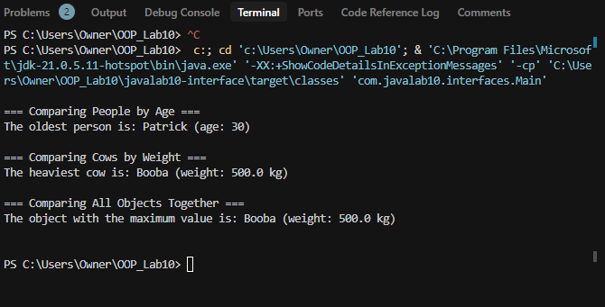

# Java Interface Implementation Lab

## Synopsis
This project demonstrates the power of Java interfaces in creating flexible and maintainable code. It showcases how different objects (Person and Cow) can be compared using a common interface, even though they compare different attributes (age vs weight). 


### 1. Creating Comparable Objects
```java
// Creating people with different ages
Person youngPerson = new Person("Tony", 25);
Person olderPerson = new Person("Patrick", 30);

// Creating cows with different weights
Cow heavyCow = new Cow("Booba", 500.0);
Cow lighterCow = new Cow("Tokyio", 450.0);
```

### 2. Comparing Objects
```java
// Comparing people by age
List<Person> people = Arrays.asList(youngPerson, olderPerson);
displayMaxValue("The oldest person is", people);
// Output: The oldest person is: Patrick (age: 30)

// Comparing cows by weight
List<Cow> cows = Arrays.asList(heavyCow, lighterCow);
displayMaxValue("The heaviest cow is", cows);
// Output: The heaviest cow is: Booba (weight: 500.0 kg)

// Comparing all objects together
List<Comparable<Double>> allObjects = Arrays.asList(youngPerson, olderPerson, heavyCow, lighterCow);
displayMaxValue("The object with the maximum value is", allObjects);
// Output: The object with the maximum value is: Booba (weight: 500.0 kg)
```

### 3. Implementation Details
The comparison works through the `Comparable` interface:
```java
public interface Comparable<T extends java.lang.Comparable<T>> {
    T getComparableValue();
    
    // Static utility method for finding maximum value
    static <T extends java.lang.Comparable<T>> Comparable<T> max(Comparable<T>[] items) {
        // Implementation using Java streams
        return Arrays.stream(items)
                    .max((a, b) -> a.getComparableValue().compareTo(b.getComparableValue()))
                    .orElseThrow(() -> new IllegalStateException("Unable to find maximum value"));
    }
}
```

## Project Structure
```
lab10-interface/
├── pom.xml                         # Maven project configuration
├── README.md                       # Project documentation
└── src/
    ├── main/
    │   └── java/
    │       └── com/javalab10/interfaces/
    │           ├── common/
    │           │   └── Comparable.java     # Core interface definition
    │           ├── model/
    │           │   ├── Person.java         # Person implementation
    │           │   └── Cow.java            # Cow implementation
    │           └── Main.java               # Demo application
    └── test/
        └── java/
            └── com/javalab10/interfaces/
                ├── model/
                │   ├── PersonTest.java     # Person class tests
                │   └── CowTest.java        # Cow class tests
                └── util/
                    └── MaxValueTest.java   # MaxValue utility tests

```
## Output


## Core Classes

### [Comparable Interface](src/main/java/com/javalab10/interfaces/common/Comparable.java)
- Defines the contract for comparable objects


### [Person Class](src/main/java/com/javalab10/interfaces/model/Person.java)
- Implements `Comparable<Double>`
- Represents a person with name and age


### [Cow Class](src/main/java/com/javalab10/interfaces/model/Cow.java)
- Implements `Comparable<Double>`
- Represents a cow with name and weight
- 

### [Main Class](src/main/java/com/javalab10/interfaces/Main.java)
- Demonstrates the usage of the interface
- Shows comparison between:
  - People by age
  - Cows by weight
  - Mixed objects (people and cows)
- Features:
  - Generic display method
  - List to array conversion
  - Error handling


